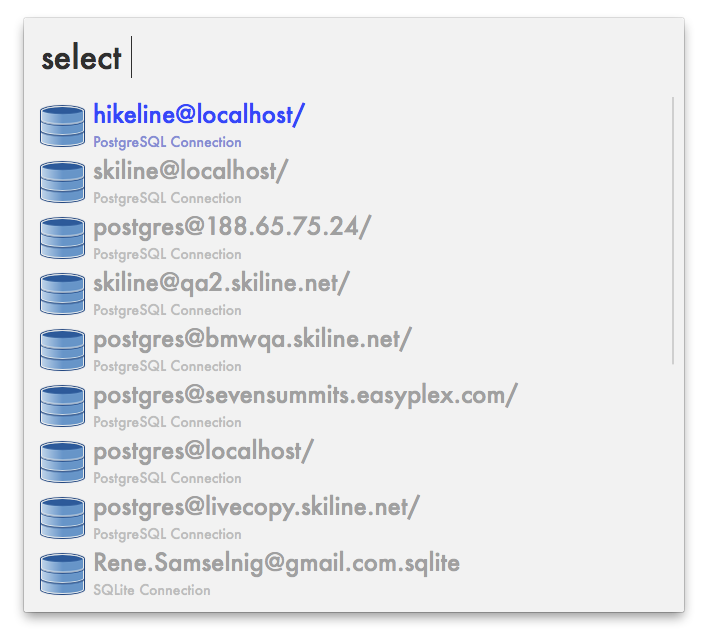

# Database Navigator

Allows you to explore, visualise and export your database. Additionally allows to explore the database using the Powerpack of Alfred 2.0.



## Main Features
* Database Navigation
* Database Visualisation
* Database Export
* Supported databases: PostgreSQL, SQLite
* Use database connection definitions from
  * the `~/.pgpass` configuration file (PGAdmin)
  * the `~/.dbexplorer/dbexplorer.cfg` configuration file (DBExplorer)
  * the Navicat configuration file (SQLite)

**Table of Contents**  *generated with [DocToc](http://doctoc.herokuapp.com/)*

- [Database Navigation](#user-content-database-navigation)
	- [Features](#user-content-features)
	- [Usage](#user-content-usage)
	- [Examples](#user-content-examples)
		- [Show Available Connections](#user-content-show-available-connections)
		- [Show Databases of Connection](#user-content-show-databases-of-connection)
		- [Show Tables of Database](#user-content-show-tables-of-database)
		- [Show Columns of Table](#user-content-show-columns-of-table)
		- [Show Rows where Column equals Value](#user-content-show-rows-where-column-equals-value)
		- [Show Rows where Column matches Pattern](#user-content-show-rows-where-column-matches-pattern)
		- [Show Rows where any (Search) Column matches Pattern](#user-content-show-rows-where-any-search-column-matches-pattern)
		- [Show Values of selected Row](#user-content-show-values-of-selected-row)
- [Database Visualisation](#user-content-database-visualisation)
	- [Features](#user-content-features-1)
	- [Usage](#user-content-usage-1)
	- [Examples](#user-content-examples-1)
		- [Show references of table](#user-content-show-references-of-table)
		- [Show References and Columns](#user-content-show-references-and-columns)
		- [Show all References recursively](#user-content-show-all-references-recursively)
		- [Show specific References](#user-content-show-specific-references)
		- [Show specific References and exclude others](#user-content-show-specific-references-and-exclude-others)
		- [Show specific References as Graphviz Graph](#user-content-show-specific-references-as-graphviz-graph)
- [Database Exporter](#user-content-database-exporter)
	- [Features](#user-content-features-1)
	- [Usage](#user-content-usage-2)
- [Installation](#user-content-installation)
- [Configuration](#user-content-configuration)
	- [Title](#user-content-title)
	- [Subtitle](#user-content-subtitle)
	- [Search](#user-content-search)
	- [Display](#user-content-display)
	- [Order](#user-content-order)

## Database Navigation

### Features
* Shows databases of configured connections
* Shows tables of databases
* Shows columns of tables for restricting rows
* Shows rows of tables with multiple restrictions (operators: =, !=, >, <, >=, <=, like)
* Shows detailed row information
* Shows info of foreign table row (based on the foreign key)
* Switch to the foreign table row (forward references)
* Shows foreign keys that point to the current table row (back references)
* Configuration of what is shown based on table comments (currently PostgreSQL only)

### Usage
```
usage: dbnav [-h] [-f LOGFILE] [-l {critical,error,warning,info,debug}] [-t]
             [-d] [-s] [-j] [-x] [-a] [-S] [-N] [-m LIMIT]
             [uri]

positional arguments:
  uri                   the URI to parse (format for PostgreSQL:
                        user@host/database/table/filter; for SQLite:
                        databasefile.db/table/filter)

optional arguments:
  -h, --help            show this help message and exit
  -S, --simplify        simplify the output
  -N, --no-simplify     don't simplify the output
  -m LIMIT, --limit LIMIT
                        limit the results of the main query to this amount of
                        rows

logging:
  -f LOGFILE, --logfile LOGFILE
                        the file to log to
  -l {critical,error,warning,info,debug}, --loglevel {critical,error,warning,info,debug}
                        the minimum level to log

formatters:
  -t, --test            output format: test specific
  -d, --default         output format: default
  -s, --simple          output format: simple
  -j, --json            output format: JSON
  -x, --xml             output format: XML
  -a, --autocomplete    output format: autocomplete
```

In Alfred the keyword is *dbnav*. The query after the keyword is the URI to your data. No options may be given.

### Examples

#### Show Available Connections
`dbnav`

#### Show Databases of Connection
`dbnav myuser@myhost/`

#### Show Tables of Database
`dbnav myuser@myhost/mydatabase/`

#### Show Columns of Table
`dbnav myuser@myhost/mydatabase/mytable/`

#### Show Rows where Column equals Value
`dbnav myuser@myhost/mydatabase/mytable/first_name=Herbert`

#### Show Rows where Column matches Pattern
`dbnav myuser@myhost/mydatabase/mytable/first_name~%erber%`

The tilde (~) will be translated to the *like* operator in SQL. Use the percent wildcard (%) to match arbitrary strings.

#### Show Rows where any (Search) Column matches Pattern
`dbnav myuser@myhost/mydatabase/mytable/~%erber%`

**Warning: this is a potentially slow query! See configuration for options to resolve this problem.**

#### Show Values of selected Row
`dbnav myuser@myhost/mydatabase/mytable/id=23/`

## Database Visualisation
Visualises the dependencies of a table using its foreign key references (forward and back references).

### Features
* Optionally display columns as well as references
* Highlights primary keys (*) and optional columns (?)
* Optionally include or exclude columns/dependencies from the graph
* Optionally enable recursive inclusion (outputs each table only once, so cycles are not an issue)
* Ouput formats include hierarchical text and a Graphviz directed graph
* Uses the same configuration and URI patterns as the Database Navigator

### Usage
```
usage: dbgraph [-h] [-f LOGFILE] [-l {critical,error,warning,info,debug}] [-t]
               [-d] [-g] [-c] [-C] [-k] [-K] [-v] [-V] [-n] [-N] [-b] [-B]
               [-M MAX_DEPTH] [-r | -i INCLUDE] [-x EXCLUDE]
               uri

A database visualisation tool that creates graphs from the database structure

positional arguments:
  uri                   the URI to parse (format for PostgreSQL:
                        user@host/database/table; for SQLite:
                        databasefile.db/table)

optional arguments:
  -h, --help            show this help message and exit
  -c, --columns         include columns in output (default: False)
  -C, --no-columns      don't include columns in output (default: True)
  -k, --back-references
                        include back references in output (default: True)
  -K, --no-back-references
                        don't include back references in output (default:
                        False)
  -v, --driver          include database driver in output (does not work well
                        with graphviz as output) (default: False)
  -V, --no-driver       don't include database driver in output (default:
                        True)
  -n, --connection      include connection in output (does not work well with
                        graphviz as output) (default: False)
  -N, --no-connection   don't include connection in output (default: True)
  -b, --database        include database in output (does not work well with
                        graphviz as output) (default: False)
  -B, --no-database     don't include database in output (default: True)
  -M MAX_DEPTH, --max-depth MAX_DEPTH
                        the maximum depth to use in recursion/inclusion
                        (default: -1)
  -r, --recursive       include any forward/back reference to the starting
                        table, recursing through all tables eventually
                        (default: False)
  -i INCLUDE, --include INCLUDE
                        include the specified columns and their foreign rows,
                        if any. Multiple columns can be specified by
                        separating them with a comma (,) (default: None)
  -x EXCLUDE, --exclude EXCLUDE
                        exclude the specified columns (default: None)

logging:
  -f LOGFILE, --logfile LOGFILE
                        the file to log to (default:
                        /usr/local/var/log/dbnav.log)
  -l {critical,error,warning,info,debug}, --loglevel {critical,error,warning,info,debug}
                        the minimum level to log (default: warning)

formatters:
  -t, --test            output format: test specific (default: None)
  -d, --default         output format: human readable hierarchical text
                        (default: True)
  -g, --graphviz        output format: a Graphviz graph (default: None)
```

### Examples

#### Show references of table
`dbgraph access@localhost/access/owner`

```
owner
+ permission_id -> permission.id
```

#### Show References and Columns
`dbgraph -c access@localhost/access/owner`

```
owner
- id*
- version
- created
+ permission_id -> permission.id
- gender?
- first_name?
- last_name?
- email?
- street?
- zip_code?
- city?
- country_code?
```
#### Show all References recursively
`dbgraph -r access@localhost/access/owner`

```
owner
+ permission_id -> permission.id
  + api_key_id -> api_key.id
    + permission (api_key_id -> id)
    + access_transaction (api_key_id -> id)
    + sales_channel (api_key_id -> id)
  + sales_channel_id -> sales_channel.id
    + api_key_id -> api_key.id
    + teaser_template_id? -> email_template.id
      + sales_channel (teaser_template_id -> id)
    + permission (sales_channel_id -> id)
  + access_transaction (permission_id -> id)
    + api_key_id -> api_key.id
    + device_id -> device.id
      + access_transaction (device_id -> id)
    + permission_id? -> permission.id
    + permission_consumption (access_transaction_id -> id)
      + access_transaction_id? -> access_transaction.id
  + owner (permission_id -> id)
```
#### Show specific References
`dbgraph -i permission_id.api_key_id access@localhost/access/owner`

```
owner
+ permission_id -> permission.id
  + api_key_id -> api_key.id
    + permission (api_key_id -> id)
    + access_transaction (api_key_id -> id)
    + sales_channel (api_key_id -> id)
  + sales_channel_id -> sales_channel.id
  + access_transaction (permission_id -> id)
  + owner (permission_id -> id)
```

#### Show specific References and exclude others
`dbgraph -i permission_id.api_key_id -x permission_id.sales_channel_id access@localhost/access/owner`

```
owner
+ permission_id -> permission.id
  + api_key_id -> api_key.id
    + permission (api_key_id -> id)
    + access_transaction (api_key_id -> id)
    + sales_channel (api_key_id -> id)
  + access_transaction (permission_id -> id)
  + owner (permission_id -> id)
```

#### Show specific References as Graphviz Graph
`dbgraph -g -i permission_id access@localhost/access/owner`

```
digraph dbgraph {
  root=owner;
  owner [shape="record" label="owner| <id> id| <version> version| <created> created| <permission_id> permission_id| <gender> gender| <first_name> first_name| <last_name> last_name| <email> email| <street> street| <zip_code> zip_code| <city> city| <country_code> country_code"];
  owner:permission_id -> permission:id [];
  permission [shape="record" label="permission| <id> id| <created> created| <api_key_id> api_key_id| <sales_channel_id> sales_channel_id| <external_sale_id> external_sale_id| <external_sale_date> external_sale_date| <external_permission_id> external_permission_id| <identification> identification| <validity_start> validity_start| <validity_end> validity_end| <value_total> value_total| <value_consumed> value_consumed| <last_consumed> last_consumed| <version> version"];
  permission:api_key_id -> api_key:id [];
  permission:sales_channel_id -> sales_channel:id [];
  access_transaction:permission_id -> permission:id [];
}
```

## Database Exporter
Exports specific rows from the database along with their references rows from other tables.

### Features
* Exports the rows matching the given URI as SQL insert statements
* Allows inclusion of referenced tables (forward and back references)
* Allows exclusion of specific columns (useful if columns are optional, or cyclic references exist)
* Takes into account the ordering of the statements (when table A references table B, then the referenced row from B must be inserted first)
* Limits the number of returned rows of the main query (does not limit referenced rows)

### Usage
```
usage: dbexport [-h] [-f LOGFILE] [-l {critical,error,warning,info,debug}]
                [-t] [-I] [-U] [-D] [-i INCLUDE] [-x EXCLUDE] [-m LIMIT]
                uri

positional arguments:
  uri                   the URI to parse (format for PostgreSQL:
                        user@host/database/table/column=value; for SQLite:
                        databasefile.db/table/column=value)

optional arguments:
  -h, --help            show this help message and exit
  -i INCLUDE, --include INCLUDE
                        include the specified columns and their foreign rows,
                        if any (multiple columns can be specified by
                        separating them with a comma)
  -x EXCLUDE, --exclude EXCLUDE
                        Exclude the specified columns
  -m LIMIT, --limit LIMIT
                        limit the results of the main query to this amount of
                        rows

logging:
  -f LOGFILE, --logfile LOGFILE
                        the file to log to
  -l {critical,error,warning,info,debug}, --loglevel {critical,error,warning,info,debug}
                        the minimum level to log

formatters:
  -t, --test            output format: test specific
  -I, --insert          output format: SQL insert statements
  -U, --update          output format: SQL update statements
  -D, --delete          output format: SQL delete statements
```

## Database Executer
Executes the SQL statements from the given file on the database specified by the given URI.

### Usage
```
usage: dbexec [-h] [-f LOGFILE] [-l {critical,error,warning,info,debug}] [-t]
              [-d] [-I] [-s STATEMENTS] [-p PROGRESS]
              uri [infile]

Executes the SQL statements from the given file on the database specified by
the given URI

positional arguments:
  uri                   the URI to parse (format for PostgreSQL:
                        user@host/database; for SQLite: databasefile.db)
  infile                the path to the file containing the SQL query to
                        execute (default: -)

optional arguments:
  -h, --help            show this help message and exit
  -s STATEMENTS, --statements STATEMENTS
                        the statements to execute (infile will be ignored when
                        this parameter is given) (default: None)
  -p PROGRESS, --progress PROGRESS
                        show progress after this amount of executions when
                        inserting/updating large data sets (default: -1)

logging:
  -f LOGFILE, --logfile LOGFILE
                        the file to log to (default:
                        /usr/local/var/log/dbnav.log)
  -l {critical,error,warning,info,debug}, --loglevel {critical,error,warning,info,debug}
                        the minimum level to log (default: warning)

formatters:
  -t, --test            output format: test specific (default: None)
  -d, --default         output format: tuples (default: None)
  -I, --insert          output format: SQL insert statements (default: None)
```

## Installation
Install the [latest egg-file](dist/dbnav-0.7-py2.7.egg) from the dist directory.

```
pip install dbnav-0.7-py2.7.egg
```

## Building
```
make install
```
Then open the *.alfredworkflow* file in the target directory using the finder.

## Configuration
It's possible to configure the content of the result items for the Database Navigation. The configuration is placed as a table comment (currently PostgreSQL only). This is mostly helpful for displaying results in Alfred, but may come in handy for the command line tools as well.

### Usage
```
{
  "title": "{0}.fname || ' ' || {0}.lname",
  "subtitle": "{0}.email || ' (' || {0}.user_name || ')'",
  "search": ["{0}.email", "{0}.user_name"],
  "display": ["fname", "lname", "email", "user_name", "security_info_id", "staff", "disqualified", "time_zone_id", "address", "id"],
  "order": ["fname", "lname"]
}
```
### Title
The *title* is the main entry within the Alfred result item. The string *{0}* will be replaced with the table alias (useful when joining with other tables that also have the given attribute present). The replaced content will then be added to the projection list as is (SQL functions may be added as well as string concatenation as in the example above).
### Subtitle
The *subtitle* is the second line within the Alfred result item. The same replacements as with the title will be applied.
### Search
The *search* array contains the columns that will be looked into when no column is present in the Alfred query. The same replacements as with the title will be applied.

This should be used to speed up the query significantly. When no *search* is configured the generated query will look something like this (see example **Show Rows where any (Search) Column matches Pattern**):

```
select
		...
	from mytable
	where
		cast(col1 as text) like '%erber%'
		or cast(col2 as text) like '%erber%'
		...
		or cast(colN as text) like '%erber%'
```

When *search* is configured as `["col1", "col7"]` the generated query will look more like this:

```
select
		...
	from mytable
	where
		cast(col1 as text) like '%erber%'
		or cast(col7 as text) like '%erber%'
```
### Display
The *display* array contains the columns that will be added to the projection list of the SQL query. All items present in the projection list will be shown in the *values* view (see example **Show Values of selected Row**). It will be added as is (no replacements will take place).
### Order
The *order* array will be added to the *order by* part of the SQL query. It will be added as is (no replacements will take place).
