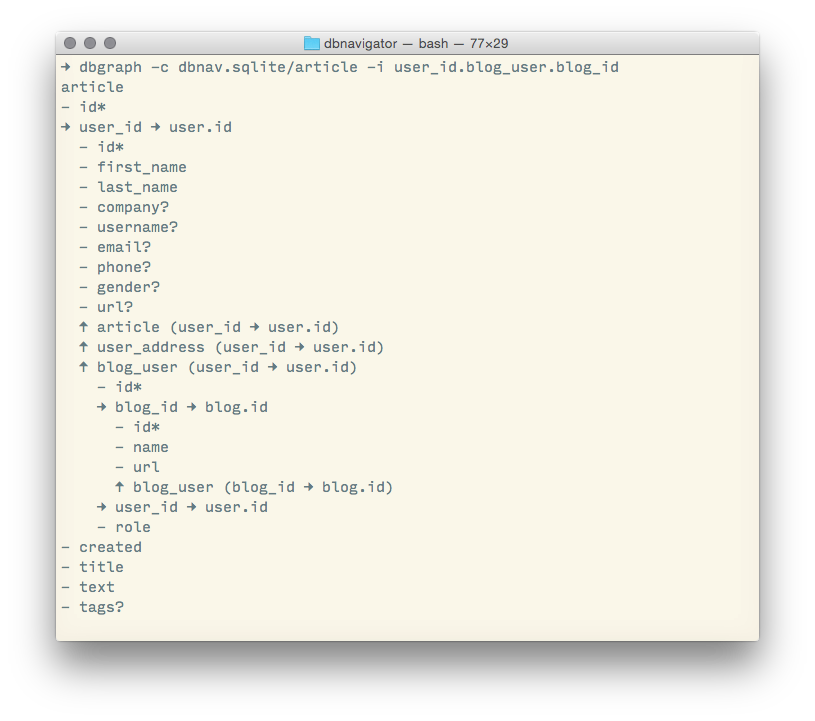
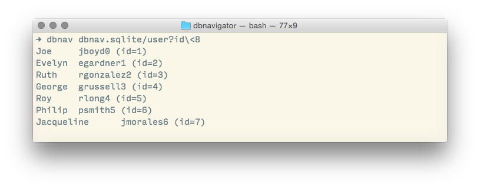
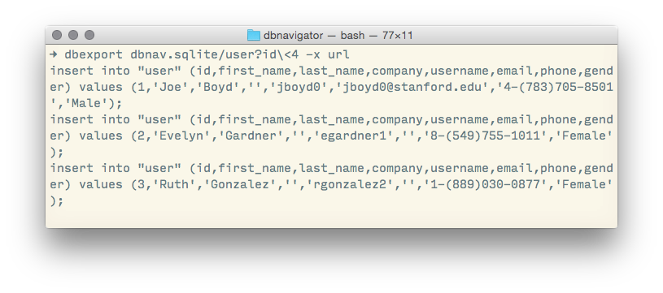
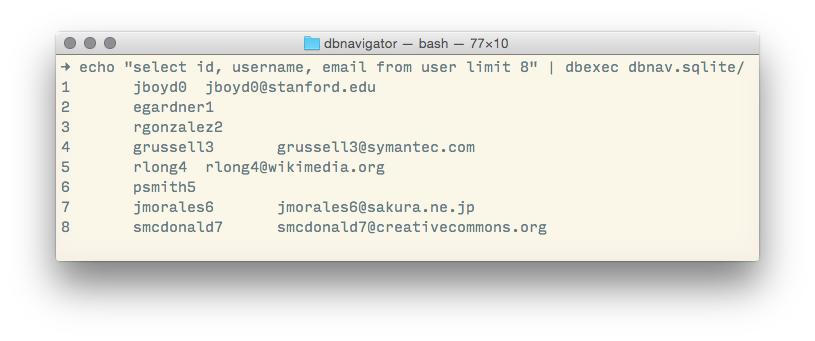
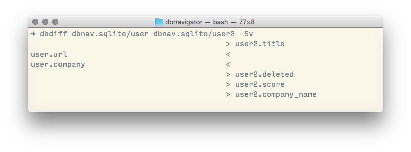

# Database Managr

[](https://travis-ci.org/resamsel/dbmanagr)
[](https://coveralls.io/github/resamsel/dbmanagr?branch=master)

Allows you to explore, visualise, and export your database recursively. Additionally allows to explore the database using the Powerpack of Alfred 2.0.



- [Main Features](#main-features)
- [Database Navigation](#database-navigation)
	- [Features](#features)
- [Database Visualisation](#database-visualisation)
	- [Features](#features-1)
- [Database Exporter](#database-exporter)
	- [Features](#features-2)
- [Database Executer](#database-executer)
- [Database Differ](#database-differ)
- [Installation](#installation)
- [Configuration](#configuration)
- [Development](#development)

## Main Features
* Database Navigation
* Database Visualisation
* Database Export
* Database Execution
* Database Diff
* Supported databases: PostgreSQL, MySQL, SQLite
* Use database connection definitions from
  * the `~/.pgpass` configuration file (PGAdmin)
  * the `~/.mypass` configuration file (like `~/.pgpass`)
  * the `~/.dbexplorer/dbexplorer.cfg` configuration file (DBExplorer)
  * the Navicat configuration file (SQLite)

## Database Navigation

Documentation: [Navigator wiki page](https://github.com/resamsel/dbmanagr/wiki/Navigator)



### Features

* Shows databases of configured connections
* Shows tables of databases
* Shows columns of tables for restricting rows
* Shows rows of tables with multiple restrictions (operators: =, !=, >, <, >=, <=, like, in)
* Shows detailed row information
* Shows info of foreign table row (based on the foreign key)
* Switch to the foreign table row (forward references)
* Shows foreign keys that point to the current table row (back references)
* Configuration of what is shown based on table comments (currently PostgreSQL only)

## Database Visualisation

Visualises the dependencies of a table using its foreign key references (forward and back references).

Documentation: [Grapher wiki page](https://github.com/resamsel/dbmanagr/wiki/Grapher)


### Features
* Optionally display columns as well as references
* Highlights primary keys (*) and optional columns (?)
* Optionally include or exclude columns/dependencies from the graph
* Optionally enable recursive inclusion (outputs each table only once, so cycles are not an issue)
* Ouput formats include hierarchical text and a Graphviz directed graph
* Uses the same configuration and URI patterns as the Database Navigator

## Database Exporter

Exports specific rows from the database along with their references rows from other tables.

Documentation: [Exporter wiki page](https://github.com/resamsel/dbmanagr/wiki/Exporter)



### Features
* Exports the rows matching the given URI as SQL insert statements
* Allows inclusion of referenced tables (forward and back references)
* Allows exclusion of specific columns (useful if columns are optional, or cyclic references exist)
* Takes into account the ordering of the statements (when table A references table B, then the referenced row from B must be inserted first)
* Limits the number of returned rows of the main query (does not limit referenced rows)

## Database Executer

Executes the SQL statements from the given file on the database specified by the given URI.

Documentation: [Executer wiki page](https://github.com/resamsel/dbmanagr/wiki/Executer)



## Database Differ

A diff tool that compares the structure of two database tables with each other.

Documentation: [Differ wiki page](https://github.com/resamsel/dbmanagr/wiki/Differ)



## Installation

Installing using PIP also upgrades to the latest version:

```
sudo pip install --upgrade git+https://github.com/resamsel/dbmanagr.git#egg=dbnav
```

You might want to install database drivers for PostgreSQL and MySQL as well:

```
sudo pip install pg8000 pymysql
```

More information and installation options can be found on the [Installation wiki page](https://github.com/resamsel/dbmanagr/wiki/Installation).

## Configuration

Configuration of *connections* is described in the [Connection Configuration wiki page](https://github.com/resamsel/dbmanagr/wiki/Connection-Configuration).

Configuration of *content* is described in the [Content Configuration wiki page](https://github.com/resamsel/dbmanagr/wiki/Content-Configuration).

## Development

More information can be found on the [Development wiki page](https://github.com/resamsel/dbmanagr/wiki/Development).

